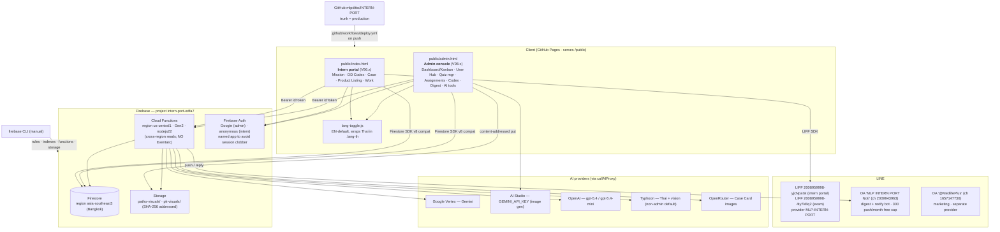
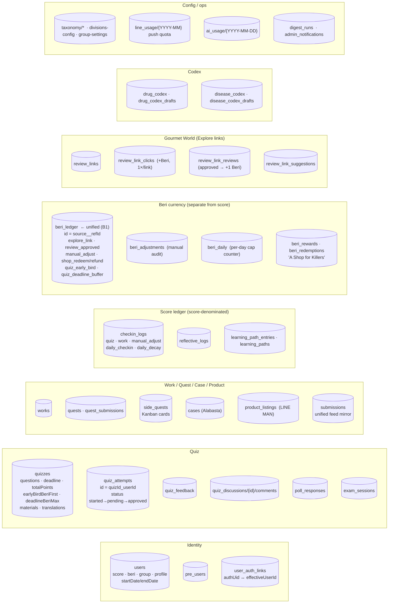
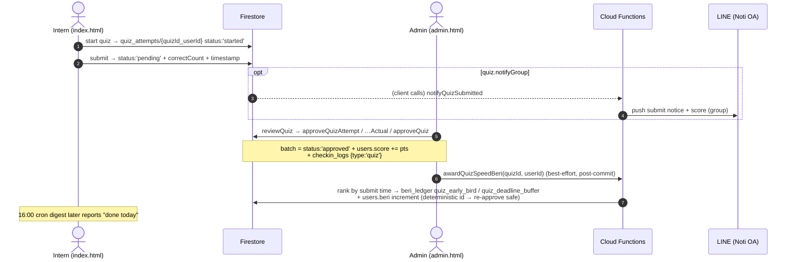
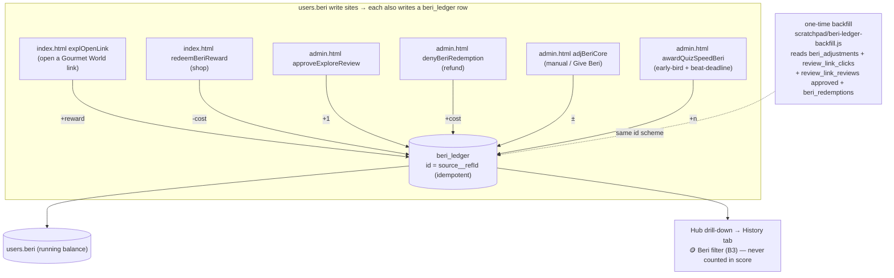
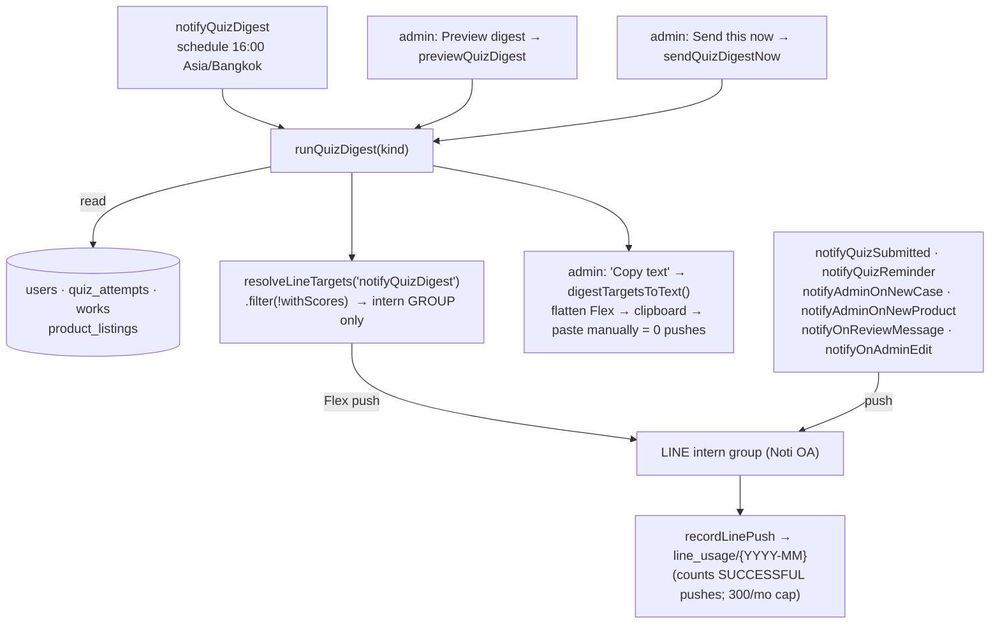
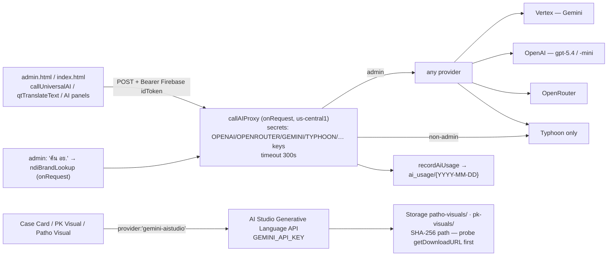

# INTERN-PORT — Architecture

A LINE **LIFF** learning-management app for medical/pharmacy interns (Thai, EN-toggle).
Frontend = two large hand-written HTML files with inline vanilla JS. Backend = Firebase
(Firestore + Cloud Functions + Storage). Notifications go out through **LINE**.

> Generated 2026-08-30 from the codebase + `.claude/.../memory/`. Diagrams drift —
> re-check against source before trusting a detail. GitHub renders the ```mermaid fences.

---

## 1. System context



**Deploy split — remember this:**

| What | How | Trigger |
|---|---|---|
| `public/` (the two HTML files + assets) | GitHub Pages via `deploy.yml` | push to `production` (~20s) |
| Firestore **rules / indexes** | `firebase deploy --only firestore:rules,firestore:indexes` | **manual, after merge** |
| Cloud **Functions** | `FUNCTIONS_DISCOVERY_TIMEOUT=120 firebase deploy --only functions:…` | **manual** (run from the non-OneDrive clone) |
| **Storage** rules | `firebase deploy --only storage` | **manual** |

The version badge in each page auto-derives from `<title>` (`Nika V98.xx` / `Internship Portfolio (V96.xx)`). Bump it on every `public/` change; serial PRs collide on that line.

---

## 2. Firestore collections (by domain)



**Two ledgers, deliberately separate.** `checkin_logs` is score-denominated (feeds
leaderboards, cert, `recalculateUserScore`). `beri_ledger` + `beri_adjustments` are
Beri and are kept **out** of `checkin_logs` so a Beri delta can never corrupt a score total.

---

## 3. Quiz lifecycle



`applyCheckinDecay` (daily cron) writes `checkin_logs {type:'daily_decay'}` + decrements
`users.score` for interns who didn't check in — the "No check-in on <date>" rows.

---

## 4. Beri flow



---

## 5. LINE digest / notify



Other LINE cost cuts already in place: digest is group-only (V98.09), `notifyQuizGraded`
removed, empty-day digests skipped (`nothing-to-report`), digest bubble day-grained.

---

## 6. AI proxy



Timeout chain: order the clocks **240 < 280 < 300** and never retry your own abort.
Vertex lags AI Studio for new Gemini models; `callAIProxy` uses Vertex, the admin.html
SDK path uses AI Studio.

---

## 7. Working copies & known traps

- **Two clones on the dev machine.** Edit `D:\20_Code\INTERN-PORT` (real `.git`, outside OneDrive). `D:\20250728OD\OneDrive\…\INTERN-PORT` is a stale mirror — never edit it (catch it by the `<title>` version).
- **OneDrive vs `.git`** — dehydration → `fatal: mmap failed`; hostname-suffixed `.git/` artifacts; stale refs faking a dirty tree. `.git` is relocated to `D:\git-repos\INTERN-PORT.git`.
- **`git checkout` inside `| tail` in an `&&` chain** hides a failure (pipe exit code is `tail`'s). Run branch switches bare.
- **`lang-toggle.js` hides Thai by default** — pure-Thai text needs `lang-no-toggle` or it vanishes under the EN body (recurred ~7×).
- **Global `button { width:100%; min-height:48px }`** (index.html:341) — any compact/icon button needs `width:auto; min-height:0` or it stretches full-width.
- **`admin.html` module vs classic scope** — a `<script type="module">` helper is invisible to classic `<script>`; `const` at classic top level is visible by bare name but not on `window`.
- Firestore is in Bangkok → **no Eventarc / no `onDocument*` triggers**; everything is HTTP/callable + `onSchedule` with caller-side invocation.
